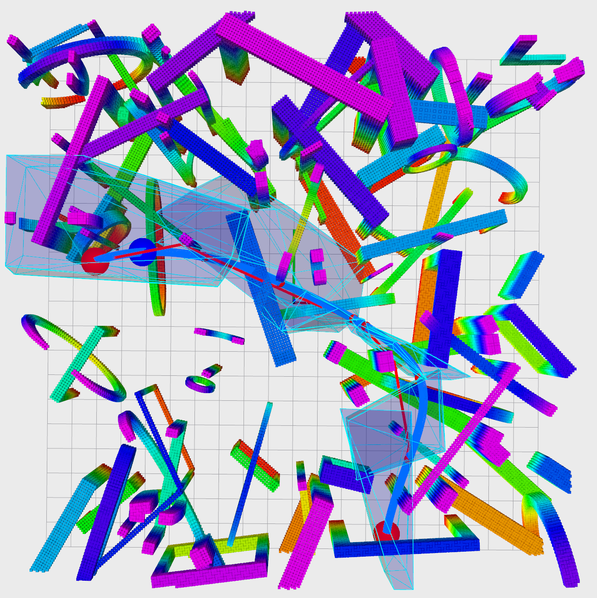
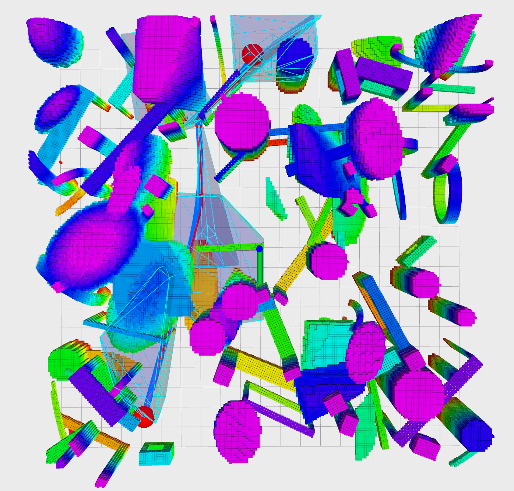
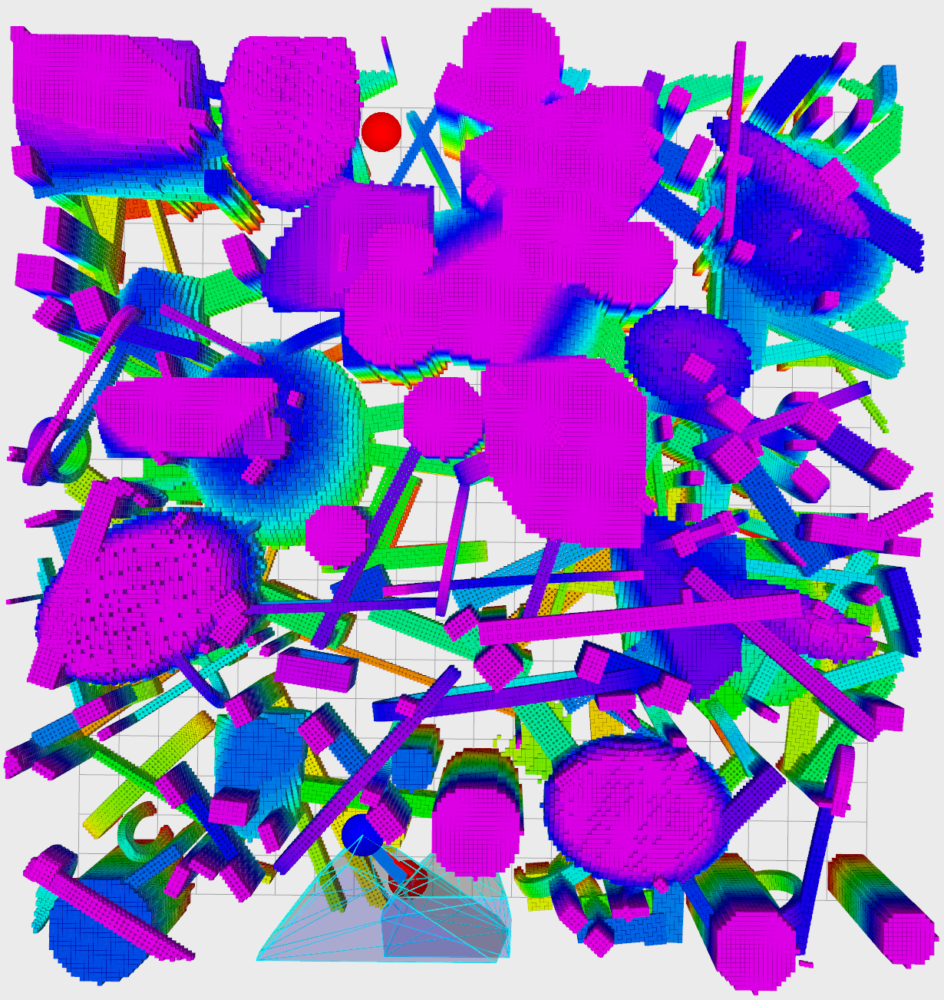

The newer version is available here: https://github.com/KumarRobotics/kr_param_map


# Parameterized Map

This repo is under construction. For mini-project users, you can directly use it.

### usage 1: structured map generation


```
roslaunch param_env structure_map.launch
```

You can adjust the approximate ratio of each element (overlapping is also counting now) in the launch file 

```
<param name="map/cylinder_ratio" value="0.10" type="double"/>
<param name="map/circle_ratio"   value="0.02" type="double"/>
<param name="map/gate_ratio"     value="0.02" type="double"/>
<param name="map/ellip_ratio"    value="0.02" type="double"/>
<param name="map/poly_ratio"     value="0.01" type="double"/>
```


Examples:

<p align="center">
  
  
  
  
</p>
